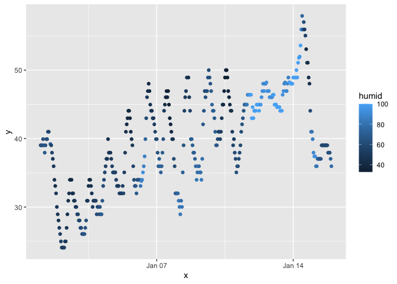

p8105_hw1_co2554 for Camille
================
Camille Okonkwo

Let’s load up the `moderndive` library and open the `early_weather_data`
dataset.

``` r
library(tidyverse)
```

    ## ── Attaching core tidyverse packages ──────────────────────── tidyverse 2.0.0 ──
    ## ✔ dplyr     1.1.3     ✔ readr     2.1.4
    ## ✔ forcats   1.0.0     ✔ stringr   1.5.0
    ## ✔ ggplot2   3.4.3     ✔ tibble    3.2.1
    ## ✔ lubridate 1.9.2     ✔ tidyr     1.3.0
    ## ✔ purrr     1.0.2     
    ## ── Conflicts ────────────────────────────────────────── tidyverse_conflicts() ──
    ## ✖ dplyr::filter() masks stats::filter()
    ## ✖ dplyr::lag()    masks stats::lag()
    ## ℹ Use the conflicted package (<http://conflicted.r-lib.org/>) to force all conflicts to become errors

``` r
library(moderndive)
data("early_january_weather")
```

# Problem 1

The `early_january_weather` dataset contains weather statistics between
01/01/2013-01/15/2013 at EWR (`origin`). Every hour, the `temp`, `dewp`,
`humid`, `wind_speed`, `wind_gust`, `precip`, `pressure`, and `visib`
are noted. There are 358 rows and 15 columns, and the average
temperature during this time is 39.5821229.

### Let’s make a scatterplot of `temp`(y) vs. `time_hour`(x).

``` r
data.frame("early_january_weather")
```

    ##   X.early_january_weather.
    ## 1    early_january_weather

``` r
x = early_january_weather[["time_hour"]]
y = early_january_weather[["temp"]]

ggplot(early_january_weather, aes(x = x, y = y, color = humid)) + geom_point()
```

<!-- -->

``` r
ggsave("scatter_plot.pdf", height = 4, width = 6)
```
