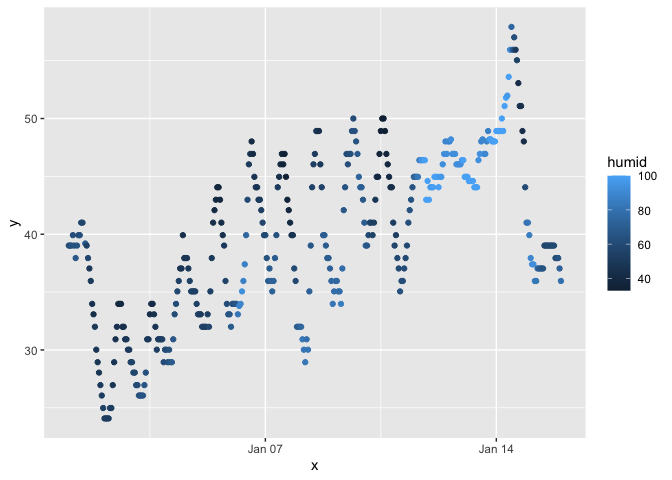

p8105_hw1_co2554
================
Camille Okonkwo

Let’s load up the `tibble` and `moderndive` libraries and open the
`early_january_weather` data set.

``` r
library(tidyverse)
library(moderndive)
data("early_january_weather")
```

# Problem 1

The `early_january_weather` data set contains weather statistics between
01/01/2013-01/15/2013 at EWR (`origin`). Every hour, the `temp`, `dewp`,
`humid`, `wind_speed`, `wind_gust`, `precip`, `pressure`, and `visib`
are noted. There are 358 rows, 15 columns, and the average temperature
during this time is 39.5821229.

### Let’s make a scatterplot of `temp`(y) vs. `time_hour`(x).

``` r
data.frame("early_january_weather")
x = early_january_weather[["time_hour"]]
y = early_january_weather[["temp"]]

ggplot(early_january_weather, aes(x = x, y = y, color = humid)) + geom_point()
```

<!-- -->

`time_hour` and `temp` appear have a positively correlated relationship.
As the `time_hour` increases, `temp` also increases.

# Problem 2

### Let’s create a dataframe with a random normal distribution.

``` r
set.seed(12345)

random_df = tibble(
  norm_samp = rnorm(10, sd =1),
  vec_logical = norm_samp > 0,
  vec_char = c("Camille", "is", "the", "best", "data", "science", "student", "at", "Columbia", "University"),
  vec_factor = factor(rep(c("sometimes", "always", "never"), length.out = 10))
)
```

#### Let’s pull the variables we established above out the dataframe so we’re able to take their means.

``` r
mean_norm_samp = mean(pull(random_df, norm_samp))
mean_vec_logical = mean(pull(random_df, vec_logical))
mean_vec_char = mean(pull(random_df, vec_char))
```

    ## Warning in mean.default(pull(random_df, vec_char)): argument is not numeric or
    ## logical: returning NA

``` r
mean_vec_factor = mean(pull(random_df, vec_factor))
```

    ## Warning in mean.default(pull(random_df, vec_factor)): argument is not numeric
    ## or logical: returning NA

We are not able to take the mean of `vec_char` and `vec_factor` because
they are not numeric variables.

#### Let’s convert `vec_logical`, `vec_char`, and `vec_factor` to numeric variables to see if we can solve this problem.

``` r
as.numeric(pull(random_df, vec_logical))
as.numeric(pull(random_df, vec_char))
```

    ## Warning: NAs introduced by coercion

``` r
as.numeric(pull(random_df, vec_factor))
```

When we try to apply the `as.numeric` function to `vec_logical`, it is
able to to translate as a binary condition. When applied to `vec_factor`
it is able to be translated to a categorical variable with three levels.
However, `vec_char` contains nominal datapoints, so it not able to be
translated to a numerical variable because the nominal data points have
no meaning.
